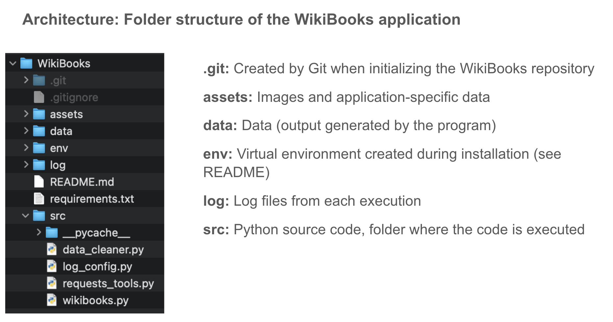
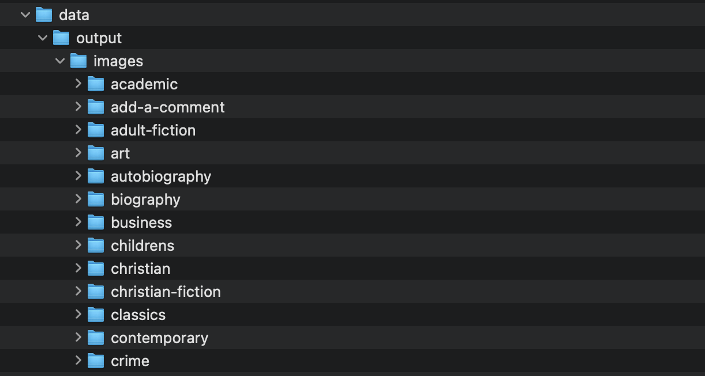
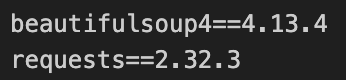

# WikiBooks
Wikibooks is an application that extracts book datas and pictures from the website [Books to Scrape](http://books.toscrape.com/) 

## Application Architecture

The screenshot shows the overall structure of the scraping and data processing pipeline.

## Data Folder Structure

This screenshots displays the organization of the downloaded images.

* **Wikibooks.cvs:**
file with all the website books data
One row per book:
    ● product_page_url
    ● universal_ product_code (upc)
    ● title
    ● price_including_tax
    ● price_excluding_tax
    ● number_available
    ● product_description
    ● category
    ● review_rating
    ● image_url

* **images repository:**
with all the website book images
Each image will be named with the title of the book + the id of the book

# Application Installation

This application need to be installed from the OCR_P02_WikiBooks repository that has been created in the company app by the git clone command 
(git clone https://github.com/DomiCarr/OCR_P02_WikiBooks)

*** enter the application repository:**
cd OCR_P02_WikiBooks

### Create and activate the virtual environment
python -m venv env
source env/bin/activate

### Install the packages from requirements.txt
pip install -r requirements.txt

### Check that the packages has been installed
pip freeze

The result must have the 2 following lines bellow:

### Run the application
cd src
python wikibooks.py

## Fabriqué avec

## Releases
**First release :** 1.0

## Authors
* **Dominique Carrasco** _alias_ [@DomiCarr](https://github.com/DomiCarr)

## License

This project has an [OpenClassrooms](https://openclassrooms.com/fr/policies/terms-conditions) license

