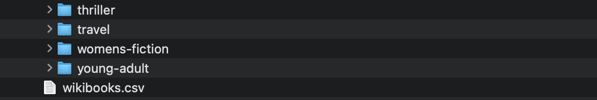

# WikiBooks
Wikibooks is an application that extracts book datas and pictures from the website [Books to Scrape](http://books.toscrape.com/) 

## Application Architecture

The screenshot shows the overall structure of the scraping and data processing pipeline.

## Data Folder Structure

The data generated by the application will be stored in the data/output folder.
The CSV file will be saved directly in data/output.
Images will be stored in category-specific subfolders automatically created by the application.
The screenshots below show an example of the folder organization.

* **Wikibooks.cvs:**
This CSV file contains detailed information for all books scraped from the website.
Each row represents a single book, with the following fields:
    ● product_page_url
    ● universal_ product_code (upc)
    ● title
    ● price_including_tax
    ● price_excluding_tax
    ● number_available
    ● product_description
    ● category
    ● review_rating
    ● image_url

* **Images repository:**
This folder contains all book cover images scraped from the website.
Each image is named using the book title followed by its unique ID to ensure clear identification and avoid duplicates.

# Application Installation

This application need to be installed from the OCR_P02_WikiBooks repository that has been created in the company app by the git clone command 
(git clone https://github.com/DomiCarr/OCR_P02_WikiBooks)

*** enter the application repository:**
cd OCR_P02_WikiBooks

### Create and activate the virtual environment
python -m venv env
source env/bin/activate

### Install the packages from requirements.txt
pip install -r requirements.txt

### Check that the packages has been installed
pip freeze

The result must have the 2 following lines bellow:

### Run the application
cd src
python wikibooks.py

## Fabriqué avec

## Releases
**First release :** 1.0

## Authors
* **Dominique Carrasco** _alias_ [@DomiCarr](https://github.com/DomiCarr)

## License

This project has an [OpenClassrooms](https://openclassrooms.com/fr/policies/terms-conditions) license

